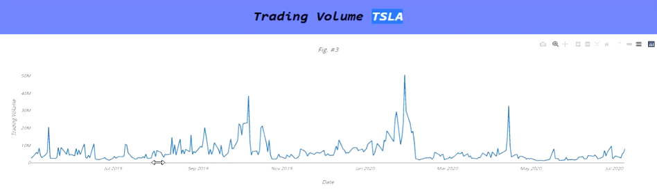

# Stock Analysis and Prediction with Machine Learning

  <a href="#data-source">Data Source</a> •
  <a href="#findings">Findings</a> •
  <a href="#technology-Used">Technology Used</a>

In this project we dive into the technical analysis for a chosen set of stocks, and training of Machine Learning Models to obtain very accurate predictions for price action, and trading volume of the stocks. Using data provided by the NASDAQ website, we were able to do the data engineering needed to train the model and then we were able to display it in the web using the Plotly Dashboard Applications. 
 

## Data Source

This [NASDAQ](https://www.nasdaq.com/market-activity/stocks/) has been updated by NASDAQ and provided to the public in the form of CSV files. 

<table class="hide-while-loading table table-striped">
<tbody id="tbody-content">
<thead>
<tr>
<th>Name</th>
<th>Date Modified</th>
<th>Type</th>
</tr>
</thead>
<tr>
<td>&nbsp;<a href="https://www.nasdaq.com/market-activity/stocks/vnftf/historical"> historicalquotesVNFTF2020</a></td>
<td>Oct 23, 2020</td>
<td>.csv file</td>
</tr>
<tr>
<td>&nbsp;<a href="https://www.nasdaq.com/market-activity/stocks/bynd/historical">historicalquoutesBYND2020</a></td>
<td>Oct 23, 2020</td>
<td>.csv file</td>
</tr>
<tr>
<td>&nbsp;<a href="https://www.nasdaq.com/market-activity/stocks/tsla/historical">historicalquotesTSLA2020</a></td>
<td>Oct 23, 2020</td>
<td>.csv file</td>
</tr>
<tr>
<td>&nbsp;<a href="https://www.nasdaq.com/market-activity/stocks/roku/historical">historicalquotesROKU2020</a></td>
<td>Oct 23, 2020</td>
<td>.csv file</td>
</tr>
</tbody>
</table>

## Findings 

### (1) The first set of data we analyzed and trained was the $BYND (Beyond Meat, Inc) stock price action. We cleaned it up and proceeded to train it with the Time Series Prediction LSTM Model (Long Short Term Memory). 

 

### The Model was able to predict the price action with an accuracy of 88.36% percent based on the accuracy test done on the analysis part. It predicted the price for the next 3 months based on the instructions written in the training code. The way the model worked to predict the price action, was similar to the way Moving Averages Indicators work. 

### (2) The next training exercise was to predict the Trading Volume for the $TSLA (Tesla) stock. When doing this, we encountered an issue with the accuracy of volume predictions; the percentage was 59.6% accuracy. This can be caused to the large amounts of volume and it definitely shows it is not the correct model to predict Volume. 

## Technology Used

